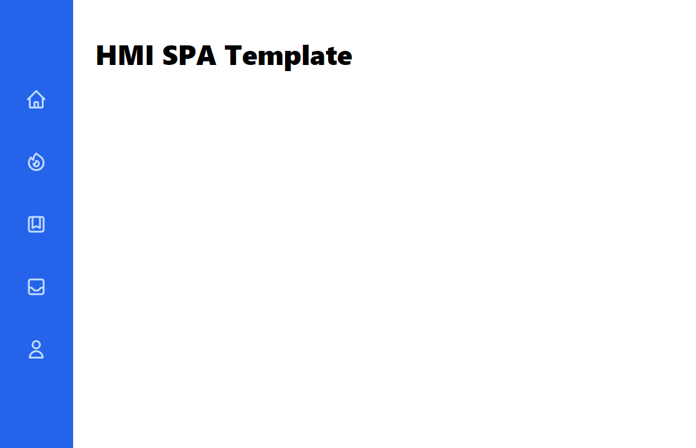
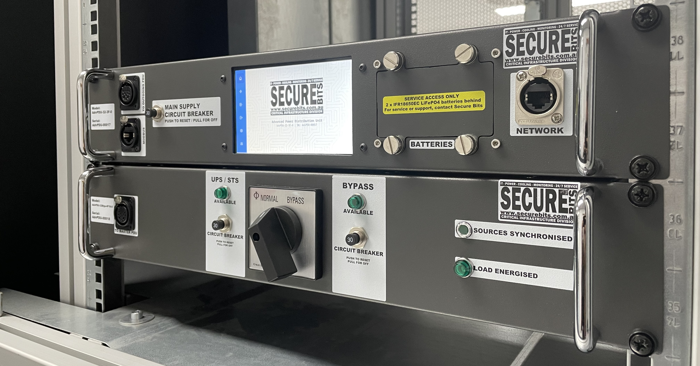
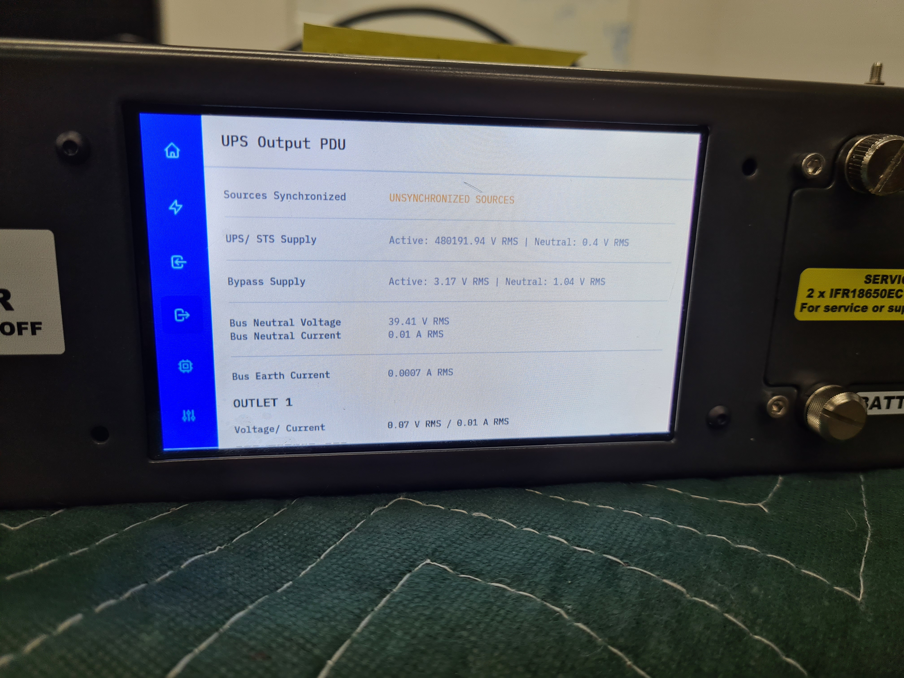

# Human-Machine Interface SPA Template
A starting point for building embedded HMI's with web frameworks. This repo is a quick starting point for future reference. Built with Vue & Tailwind

## Examples
#### Secure Bits AdvPDU
  
  
*Ignore the voltage, its from a test*
